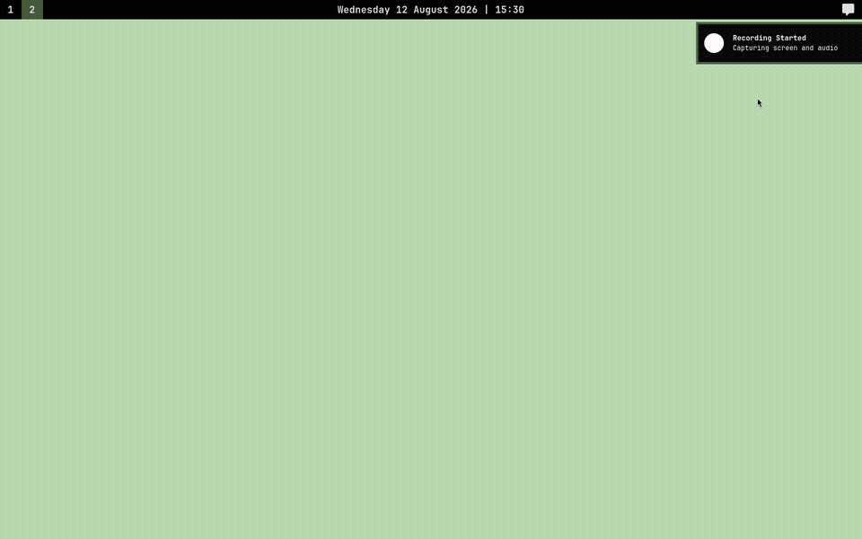
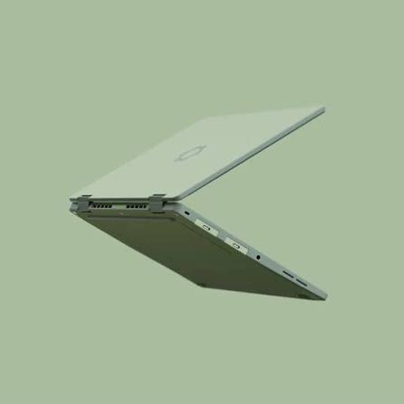

# Arch Linux Dotfiles

Personal Arch Linux configuration.

## Specifications

  <table>
    <tr>
      <td align="left" valign="top" width="50%">
        <ul align="left">
          <li><strong>Laptop</strong>: Framework 12 (Sage)</li>
          <li><strong>CPU</strong>: Intel Core Ultra Series 2</li>
          <li><strong>GPU</strong>: Intel Arc (integrated)</li>
          <li><strong>Storage</strong>: 1 TB NVMe SSD</li>
          <li><strong>RAM</strong>: 32 GB</li>
          <li><strong>Display</strong>: 12.2" 1920×1200</li>
          <li><strong>OS</strong>: Arch Linux (rolling)</li>
          <li><strong>Shell</strong>: Zsh</li>
          <li><strong>Window manager</strong>: Sway (Wayland)</li>
        </ul>
      </td>
      <td width="50%">
        
      </td>
    </tr>
  </table>

## Color palette

The color scheme are inspired by the **Framework 12 Sage** laptop.

| Color            | Hex       | Used for                                        |
| ---------------- | --------- | ----------------------------------------------- |
| Black            | `#000000` | Backgrounds (Sway windows, Waybar, Kitty)       |
| Off-white        | `#e0e0e0` | Primary text                                    |
| Sage green       | `#b8d9ae` | Accent, wallpaper, urgent/active states, cursor |
| Olive green      | `#4a5d46` | Focused borders, indicators                     |
| Muted gray-green | `#6e6e70` | Inactive/unfocused elements                     |

## Tools

| Tool          | Files                                                | Purpose                                                                |
| ------------- | ---------------------------------------------------- | ---------------------------------------------------------------------- |
| bash          | `.bash_logout`, `.bash_profile`, `.bashrc`           | Minimal interactive Bash shell setup.                                  |
| clipse        | `.config/clipse/`                                    | Clipboard manager with history.                                        |
| galendae      | `.config/galendae/`                                  | Calendar popup launched from Waybar.                                   |
| gtrash        | `.config/gtrash/`                                    | Trash wrapper; `rm` aliases put files in trash.                        |
| kitty         | `.config/kitty/`                                     | Terminal emulator with custom colors and font.                         |
| notse         | `.config/notse/`                                     | Terminal-based note-taking app.                                        |
| neovim        | `.config/nvim/`                                      | Editor with Lazy.nvim plugin manager.                                  |
| npm           | `.npmrc`                                             | npm global install prefix.                                             |
| opencode      | `.config/opencode/`                                  | OpenCode AI agent config and MCP servers.                              |
| powerlevel10k | `.p10k.zsh`                                          | Zsh prompt theme.                                                      |
| r             | `.Renviron`, `.Rprofile`                             | R environment and renv setup.                                          |
| rclone        | `.config/rclone/`                                    | Google Drive sync script and filters.                                  |
| sway          | `.config/sway/`, `.zprofile`                         | Wayland tiling window manager; `.zprofile` auto-starts Sway on `tty1`. |
| swaync        | `.config/swaync/`                                    | Notification center and control center.                                |
| swayosd       | `.config/swayosd/`                                   | On-screen display for volume and brightness.                           |
| systemd       | `.config/systemd/user/`                              | User services and timers.                                              |
| timeshift     | `.config/timeshift/`                                 | System snapshot scheduling.                                            |
| waybar        | `.config/waybar/`                                    | Top bar with workspaces, clock, and custom menu.                       |
| wofi          | `.config/wofi/`                                      | Application launcher and screenshot/cast menus.                        |
| XDG user dirs | `.config/user-dirs.dirs`, `.config/user-dirs.locale` | Default directory names.                                               |
| yazi          | `.config/yazi/`                                      | Terminal file manager.                                                 |
| zathura       | `.config/zathura/`                                   | Minimal PDF reader.                                                    |
| zellij        | `.config/zellij/`                                    | Terminal multiplexer with custom layouts.                              |
| zsh           | `.zshrc`, `.zprofile`                                | Main shell with Zinit, aliases, and Wayland env vars.                  |
